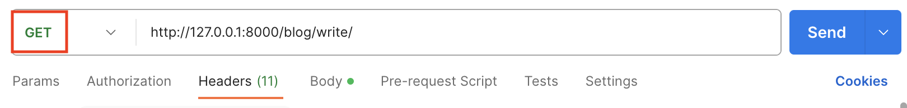
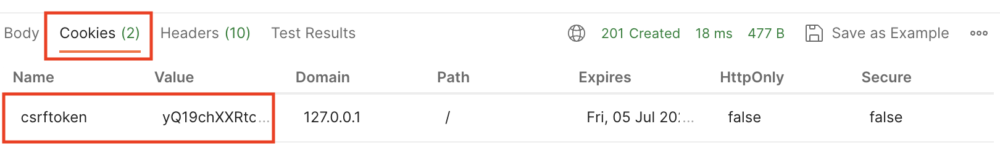
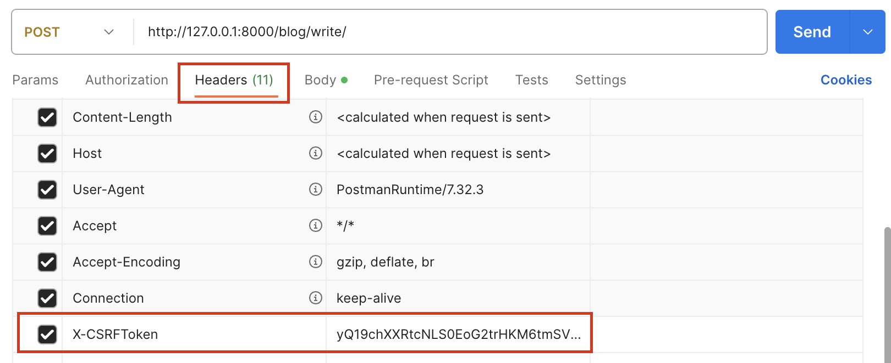

LoginRequiredMixin 예제 코드
LoginRequiredMixin 에서 로그인하지 않은 유저가 해당 클래스에 접근했을 경우, login으로 이동시켜준다고 말씀드렸었는데요~!
이때 login 이 아닌 다른 페이지로 이동시켜주기 위해서는 next_url 등의 키워드로 새로운 경로를 설정해줄 수 있습니다.
먼저 html 화면에서 form을 랜더링할 때,

```py
    <form action= method=‘post’>
        <input type="hidden" name="next" value="{{ request.get_full_path }}">
        …
    </form>
```

이렇게 input hidden 으로 원하는 경로를 넣어주고

```py
class Write(LoginRequiredMixin, View):
    …
    def post(self, request):
        form = PostForm(request.POST)
        if form.is_valid():
            next_url = form.cleaned_data[‘next’]
                post = form.save(commit=False)
                post.writer = request.user
                post.save()
        if next_url:
            return redirect(next_url)
                return redirect('blog:list')
```

class 부분에서 next_url 유무에 따라 redirect 설정을 다르게 해주거나 html 랜더링 시 next_url을 원하는대로 설정해주는 방법으로
다음 경로를 변경해줄 수 있습니다. (예제 코드는 기존 코드를 가지고 간단한 예제를 만든 것이니 흐름만 이해하시고 제대로 동작하는 코드가 아닐 수 있다는 것을 알아주세요 🙂 )

select_related 쿼리
select_related는 서로 관계가 있는 모델끼리의 JOIN 기능을 해주는 쿼리입니다.
관계가 있는 모델의 경우 모델끼리의 관계를 통해 자동으로 JOIN을 수행해줍니다.
예를 들어, comments = Comment.objects.select_related(‘post\_\_user’) 라는 쿼리가 있다면 Comment 모델에서 Post 모델을 통해 User 모델에 접근할 수 있게 도와주며 post와 관련된 user를 조인해서 가져올 수 있습니다. 이때 언더바 두 개로 관련있는 모델들을 명시해줄 수 있습니다.
postman
기존 개발 방식과 다르게 Django Rest Framework으로 개발을 하게 되면 API 통신을 이용하게 됩니다. 이에 따라 화면 구성은 하지 않고 요청에 따른 응답값을 serializer를 통해 데이터만 보내주게 되는 것이죠. 그래서 기존에 템플릿을 통해 랜더링된 화면을 확인할 수 없으니 해당 요청에 대한 응답이 제대로 작동하는 지 확인하려면 postman을 이용해야합니다.
간단한 GET 요청의 경우, url과 method만 잘 넣어주면 제대로 동작 테스트를 할 수 있지만 POST 요청의 경우 csrf 토큰에 대한 추가적인 처리를 해주어야 합니다.

먼저 Write 클래스에 대한 POST 요청 동작을 만들어주기 위해서는

1.요청에서 GET을 먼저 선택해주세요.
2.url 주소에서 http://127.0.0.1:8000/blog/write/ 를 입력해주세요. (마지막 / 를 꼭 입력해야 오류가 나지 않습니다.)
3.Send 버튼을 눌러 GET 요청을 보내줍니다.

POST 요청만 만든 클래스에 GET 요청을 보내게 되면,
당연히 오류가 발생하면서 해당 요청에 대한 응답은 실패하게 됩니다.
그런데 이때 결과창의 Cookies 탭을 눌러보면 csrftoken이 생성된 것을 볼 수 있습니다.

이제 이 값으로

1.요청의 Headers 탭을 선택해주세요.  
2.마지막에 key값을 X-CSRFToken로 입력, value 값을 Cookies탭의 csrftoken의 Value값을 복사해서 붙어넣어주세요.

이렇게 두 단계를 거치게 되면 해당 csrftoken으로 POST 요청을 테스트할 수 있게 됩니다.

위와 같은 설정으로 csrf token을 가지고 온 뒤, POST 요청을 테스트하시면 결과를 화면없이 확인할 수 있습니다 🙂
